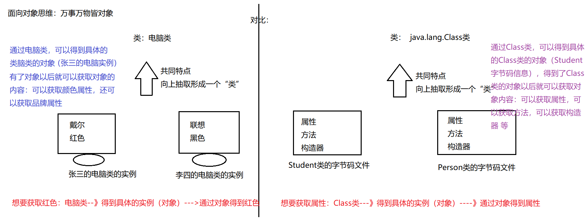

<div><h1 align="center">反射</h1></div>

<hr />

## 1. 引入反射

<hr />

> 业务场景：现在有一个支付的接口需要实现，支付宝可以实现/ 微信可以实现/ XXX 银行可以实现。 我们需要在前端通过选择支付方式来进行支付。 接下来看下多态以及反射是如何实现的

### 代码引入

- 接口定义

```shell
public interface IPay {
  void payOnline();
}
```

- 微信实现接口

```shell
public class WeChatPay implements IPay {
  @Override
  public void payOnline() {
    System.out.println("这是微信支付");
  }
}
```

- 支付宝实现接口

```shell
public class AliPay implements IPay {
  @Override
  public void payOnline() {
    System.out.println("这是支付宝支付");
  }
}
```

- 通过多态来实现功能

```shell
public class Test {
  public static void main(String[] args) {
    // 表示从前端接受的支付方式
    String flag = "";
    if (Math.random() > 0.5) {
      flag = "支付宝";
    } else {
      flag = "微信";
    }

    if ("支付宝".equals(flag)) commonPay(new AliPay());
    if ("微信".equals(flag)) commonPay(new WeChatPay());
  }

  public static void commonPay(IPay pay) {
    pay.payOnline();
  }
}
```

> 1. 以上就是通过多态来实现，通过不同的判断调用不同的支付方式
> 2. 但是还是不够灵活。因为虽然目前实现了两个支付，但是后续可能会更多支付。那么这里就需要不断的写判断了
> 3. 那么下来 看下反射机制 是如何实现这个功能的

- 通过反射来实现通过

```shell
public class Test1 {
  public static void main(String[] args) throws ClassNotFoundException, InstantiationException, IllegalAccessException, NoSuchMethodException, InvocationTargetException {
    String path = Math.random() > 0.5 ? "com.lihh.reflect1.AliPay" : "com.lihh.reflect1.WeChatPay";

    Class c = Class.forName(path);
    Object o = c.newInstance();

    Method m = c.getMethod("payOnline");
    m.invoke(o);
  }
}
```

> 1. 上述是反射的实现逻辑，从抽象层面（其实就是将类同样抽象化了）开始来对方法进行调用
> 2. 实际上不太需要关心，添加新的判断类同时进行方法调用

## 2. 从概念上理解反射

<hr />



### 定义

> - 类是对`对象`的高度抽象化。反射 Class 是对`类`的高度抽象化
> - JAVA 反射机制是在运行状态中，对于任意一个类，都能够知道这个类的所有属性和方法
> - 对于任意一个对象，都能够调用它的任意方法和属性；这种动态获取信息以及动态调用对象方法的功能称为 java 语言的反射机制

### 原理过程

> - 在编译后产生字节码文件的时候，类加载器子系统通过二进制字节流，负责从文件系统加载 class 文件
> - 在执行程序（java.exe）时候，将字节码文件读入 JVM 中--->这个过程叫做类的加载
> - 然后在内存中对应创建一个 java.lang.Class 对象-->这个对象会被放入字节码信息中
> - 这个 Class 对象,就对应加载那个字节码信息,这个对象将被作为程序访问方法区中的这个类的各种数据的外部接口
> - 说明：在运行期间，如果我们要产生某个类的对象，Java 虚拟机(JVM)会检查该类型的 Class 对象是否已被加载。 如果没有被加载，JVM 会根据类的名称找到.class 文件并加载它。一旦某个类型的 Class 对象已被加载到内存，就可以用它来产生该类型的所有对象

## 3. 获取字节码的多种方式

<hr />

```shell
public class Test {
  public static void main(String[] args) throws Exception {
    // 获取字节码 信息的4种方式
    // 1. 通过实例的getClass 函数
    Person p = new Person();
    Class c1 = p.getClass();
    System.out.println(c1);

    // 2. 通过内置属性
    Class c2 = Person.class;
    System.out.println(c2);

    // 3. 通过静态方法forName 进行调用
    Class c3 = Class.forName("com.lihh.reflect.Person");
    System.out.println(c3);

    // 4. 利用类的加载器
    ClassLoader loader = Test.class.getClassLoader();
    Class c4 = loader.loadClass("com.lihh.reflect.Person");
    System.out.println(c4);
  }
}
```

> - 第一种方式通过类实例本身的`getClass` 方法来实现
> - 第二种方式通过类构造函数种属性`class` 来实现
> - 第三种方式通过 Class 的静态方法`forName`来实现
> - 第四种方式通过系统加载器来来实现
