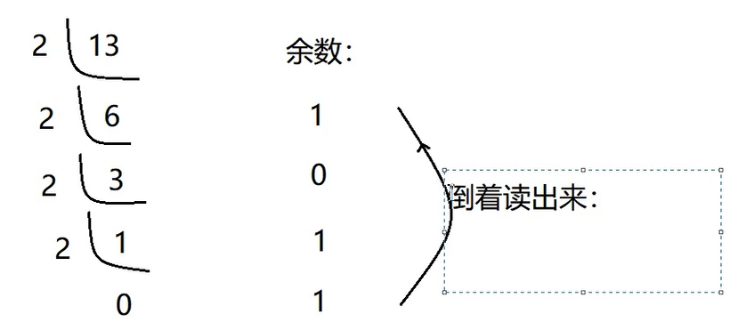

## 数据类型

### 标识符

- 包/ 类/ 变量/ 方法等等 只要起名字的地方，那个名字就是标识符
- 规则：
  - 四部分任意组成：数字/ 字母/ 下划线/ 美元符号
  - 一般尽量使用英文字母
  - 两个不可以：不可以以数字开头，不可以使用 Java 中的关键字
  - 大小写敏感
  - 长度无限制，但是不建议很长

### 变量 常量

- Java 是一种强类型的语言
- 如果只是定义变量，但是没有进行赋值的话(没有使用的话)，编译后直接删除掉(tree shaking)
- 变量如果没有进行赋值的话，那么使用的时候会出错。直接报错`变量未初始化`
- `javap -v XXX.class` 进行更详细的反编译，针对 class 文件
- **变量不可以重复定义**
- 作用范围是：距离最近的花括号
- 局部变量(`定义在方法中`)/ 成员变量(`定义在类中，方法外`)

### 数据类型


#### 整数类型

##### 进制

- 进制：就是逢几进一
  - 十进制
  - 八进制：要求以 0 开头
  - 十六进制：要求 0x 或是 0X 开头
  - 二进制：要求以 0b 或是 0B 开头
- 进制转换
  
  

##### 整数数据类型


##### 浮点数据类型

- float 类型是单精度类型，尾数可以精确到 7 位有效数字，很多情况下很难满足需求。
- double 类型是双精度类型，精度约 float 类型的 2 倍，，默认情况下就是 double 类型
- float 类型的数值有一个后缀 F 或是 f，没有后缀的默认就是 double 类型
- PS:`有效数字：从左开始第一个不为0的数到最后一个数`

> - 浮点类型默认就是 double 类型
> - 最好不要进行浮点类型的比较


##### 编码


##### 字符数据类型


- 是使用单引号 括起来的
- char 本质是 UTF-16 编码。实际上是一个变长编码
- char 类型是按照 Unicode 码表进行存储的。(Unicode 兼容了 ASCII 码)
- char 类型底层是按照 Unicode 进行存储。所以参与运算的时候，是使用 Unicode 进行运算的
- 转义字符
  
  

```java
public class Chars {
    public static void main(String[] args) {
        char a = '2';
        System.out.println(a);
        // char类型底层是按照Unicode进行存储。所以参与运算的时候，是使用Unicode进行运算的
        System.out.println(a + 90);


        // char类型的值 赋值给int的时候 会默认进行类型转换
        int b = a;
        System.out.println(b);

        int c = 50;
        System.out.println(c);

        // 面试题
        // 先将字符2 转换为Unicode值 为50. 将50 以及2进行运算。运算后转换为char类型
        char d = '2' + 2;
        System.out.println(d);
    }
}
```
