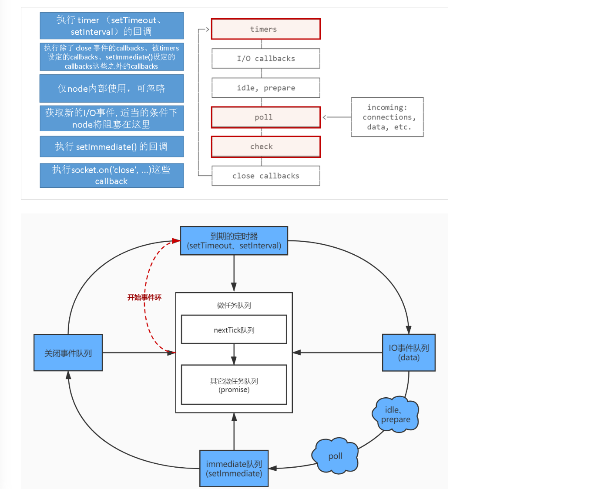

## 事件循环
> 分析事件循环的之前，因为js线程的主线程是单线程的。所以会优先分析下浏览器的进程以及线程

### 线程以及进程
- 进程是资源调度的最小的单位
- 线程是cpu调度的最小单位
- 浏览器是多个进程架构，每个tab都是一个独立的进程，保证每个进程之前互相不影响。同时每个tab包括多个工作进程
    - 浏览器主进程
      - 控制其他子进程的创建以及销毁
      - 浏览器界面显示。比如：用户的交互/ 前进/ 后退
      - 将渲染的内容绘制到用户界面上
    - 渲染进程
      - GUI渲染线程
      - JS引擎线程
      - 事件触发线程
      - 定时器触发线程
      - 异步HTTP请求线程
      - IO线程
    - 网络进程
      - 网络请求，文件访问等
    - GPU进程
      - 用于3D绘制等
    - 插件进程

### 事件循环

#### 宏任务分类
- 渲染事件
- 用户交互
- JavaScript 脚本执行
- 网络请求
- 文件读写
- script(整体代码)
- setTimeout
- setInterval
- setImmediate
- I/O 
- UI render
#### 微任务分类
- process.nextTick
- promise
- MutationObserver

#### 执行过程
- script本身就是一个宏任务，执行代码过程中会将宏任务放到队列中，依次执行
- 每个宏任务都会创建一个对应的微任务队列。执行期间遇到微任务会将其放入其中
- 在执行下次宏任务之前，会先清空上一次宏任务创建的微任务队列
- 如果遇到定时器，会将定时器放置到延时队列中，在eventloop执行过程中检查延迟任务是否到期，到期后放置到宏任务队列中

### 运行实例
```js
Promise.resolve().then(() => { // then1
    console.log(0);
    return new Promise((resolve)=>{ // then2
        resolve('a');
    })
}).then(res => { // then3
    console.log(res)
})
Promise.resolve().then(() => { // then4
    console.log(1);
}).then(() => { // then5
    console.log(2);
}).then(() => { // then6
    console.log(3);
}).then(() => { // then7
    console.log(4);
}).then(() => { // then8
    console.log(5);
})
// 0 1 2 3 a 4 5
```
- 先执行同步代码，执行结束后将上述的then1 then4 放入到队列中
- 同步代码执行结束，从队列中执行任务。先拿出then1 开始执行。打印`console.log(0)`, 执行new Promise 返回Promise实例，此时then2加入队列中
- 执行微任务then4的任务，打印`console.log(1)` ，实际返回undefined。then5入队列
- 执行then2 将实例传递到then3 then3入队列
- 执行then5 任务，打印`console.log(2)`. then6入队列
- 执行then3 因为then3参数是一个promise实例，需要调用.then 所以.then 入队列
- 执行then6 打印`console.log(3)` then7入队列
- 执行.then 任务。打印`console.log(a)`.
- 依次执行then7 then8
```js
Promise.resolve().then(() => {
  console.log(0);
  return Promise.resolve(Promise.resolve(Promise.resolve('a')))
}).then((res) => {
  console.log(res)
})
Promise.resolve().then(() => {
  console.log(1);
}).then(() => {
  console.log(2);
}).then(() => {
  console.log(3);
}).then(() => {
  console.log(4);
}).then(() => {
  console.log(5);
})
// 0 1 2 3 a  4 5
```

