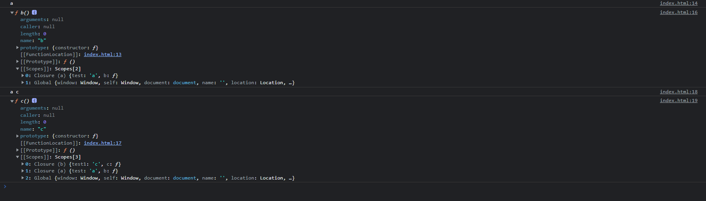
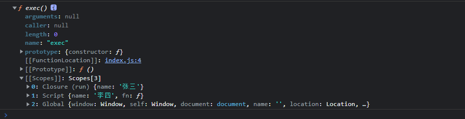

## 作用域
> 今天主要是阐述下什么是作用域，作用域是干什么的，作用域在传统的JavaScript中既`基础`又`重要`

### 什么是作用域
> - 当查找变量的时候，会先从当前上下文的变量对象中查找，如果没有找到，就会从父级(词法层面上的父级)执行上下文的变量对象中查找，一直找到全局上下文的变量对象，也就是全局对象。这样由多个执行上下文的变量对象构成的链表就叫做作用域链
> - 函数的作用域跟函数定义的位置有关系，跟执行的位置无关
>   - 这是因为函数有一个内部属性 [[scope]]，当函数创建的时候，就会保存所有父变量对象到其中，你可以理解[[scope]] 就是所有父变量对象的层级链，但是注意：[[scope]] 并不代表完整的作用域链
- 实例代码
```js
      function a() {
        const test = 'a'
        function b() {
          console.log(test)
          const test1 = 'c'
          console.dir(b)
          function c() {
            console.log(test, test1)
            console.dir(c)
          }
          c()
        }
        b()
      }
      a()
```


### 为什么说跟定义位置有关?跟执行位置无关?
```js
const name = '李四'
function run() {
  const name = '张三'
  return function exec() {
    console.log(name) // 张三
    console.dir(exec)
  }
}

const fn = run()
fn()
```

- 上述结果是`张三`并非`李四`。其实也是说明了变量的查询范围跟定义的位置有关，跟执行的位置无关。为什么会会先这种结果呢？？？
- 因为在函数创建的时候，函数的作用域链已经确定好了，当函数无论在什么位置执行。当前作用域查询不到变量时，会沿着作用域链向上查找。直到找到位置/ 找到顶级作用域也找不到

> 关注我的[GitHub博客](https://github.com/a572251465/my-blog),会不断更新基础知识/ 源码分析/ 工程化等

