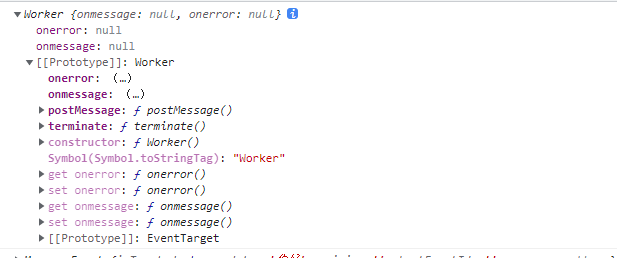

## 创建对象方式哪几种

> - `const obj = new Object` new Object 的形式来创建
> - `const obj = {}` 通过字面量的形式来创建
> - `const obj = Object.create(null)`
> - **不同：**
>   - 如果使用`{}`只能构造 object 相关数据类型
>   - 使用`new Object`进行传递参数的时候（例如：基本数据类型/ Set/ Map），会构造出对应包装数据类型
>   - 如果使用`Object.create(null)`, 构造出来对象无任何`原型链`

### 第一种方式

> 通过`var a = new Object()` 来创建

- 使用`new Object`可以自由的传递参数。
- 如果是传递基本数据类型/ Set/ Map 等，会构造对应的包装数据类型

### 第二种方式

- 第二种方式跟第一种方式没有什么不同，只不过更加简单了

### 第三种方式

> 第三种方式创建出来是一个空白对象，没有任何原型链继承

