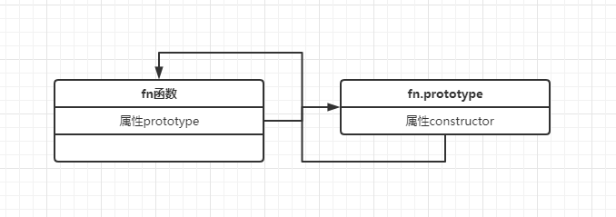
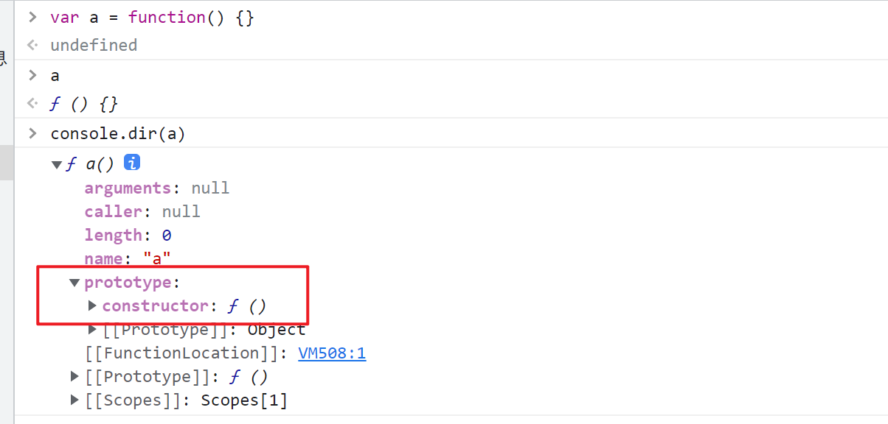

## 原型到原型链
> 原型以及原型链时js基础部分，基础中的基础，重点中的重点

### prototype
- 其实函数在被创建时，会存在两个值。一个是函数本身，另一个是`fn.prototype`. 可以理解为函数天生就是`双胞胎`
- 每个函数上都会存在一个属性`prototype`，这个属性指向`fn.prototype`
- `函数.prototype`上存在属性`constructor`，该属性指向函数本身




```js
function User() {}

console.log(User.prototype.constructor === User) // true
```

### __proto__
-   每个实例都会存在属性__proto__, 实例.__proto__ 会指向函数的原型对象
-   特例：具体构造函数.__proto__ === Function.prototype。停停停!!! 不是只有实例上才有属性__proto__ 吗，为什么函数也可以调用呢？-- 是因为具体的构造函数也是Function的实例
- 函数以及实例的__proto__尽头一定是`Function.prototype`
```js
function Person() {}
const person = new Person()

// 实例.__proto__ 指向构造函数.prototype
console.log(person.__proto__ === Person.prototype) // true
console.log(person.__proto__ === Object.getPrototypeOf(person)) // true

// 特例：具体函数.__proto__ 指向了Function.prototype
console.log(Person.__proto__ === Function.prototype) // true

// 特例：函数本身.__proto__ === 指向了Function.prototype
console.log(Function.__proto__ === Function.prototype) // true
```

### constructor
-   原型对象prototype存在属性`constructor`, 该属性指向构造函数本身
```js
function Person() {}
const person = new Person()

// 原型对象上存在属性<constructor> 指向
console.log(Person === Person.prototype.constructor)

// 实例的构造函数
console.log(person.constructor)
// person本身没有constructor属性
console.log(Object.prototype.hasOwnProperty.call(person, 'constructor')) // false
// 其实是通过原型继承来的
console.log('constructor' in person) // true
```

### 实例以及原型
> 实例是通过属性`__proto__`一直向上寻找属性，先是实例自己属性 => 原型属性 => 父类实例属性 => 父类原型属性... 以此类推
```js
function User() {
  this.name = 'xxx1'
}

const u = new User()
console.log(u.name) // xxx1

function User1() {}

User1.prototype.name = 'xxx2'
const u1 = new User1()
console.log(u1.name) // xxx2

function User2() {}
// User2.prototype.name = 'xxx3'
const u2 = new User2()
// 最起码保证u2.__proto__ 没有被重写
u2.__proto__.__proto__ = u
console.log(u2.name) // xxx1

function User3() {}
const u3 = new User3()
u3.__proto__.__proto__ = u1
console.log(u3.name) // xxx2
```

### 补充
- 所有`函数.__proto__` 都会指向`Function.prototype`
- 所有`函数.prototype.__proto__`都会指向`Object.prototype`