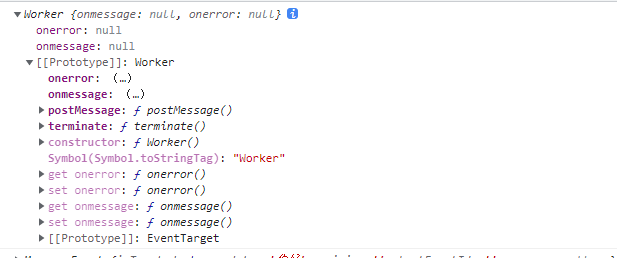
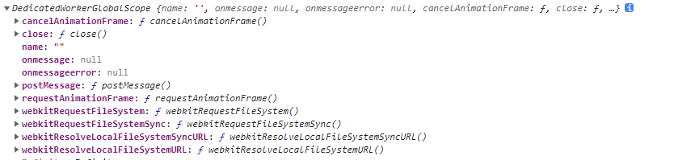

## 工作者线程

### 简介

- JavaScript 环境实际上是运行在托管操作系统中的虚拟环境。在浏览器中每打开一个页面，就会分配一个它自己的环境。这样，每个页面都有自己的内存、事件循环、DOM，等等。每个页面就相当于一个沙盒，不会干扰其他页面。对于浏览器来说，同时管理多个环境是非常简单的，因为所有这些环境都是并行执行的
- 使用工作者线程，浏览器可以在原始页面环境之外再分配一个完全独立的二级子环境。这个子环境不能与依赖单线程交互的 API（如 DOM）互操作，但可以与父环境并行执行代码

### 工作者线程以及普通线程不同

- 工作者线程是以实际线程实现的
- 工作者线程并行执行
- 工作者线程可以共享某些内存
- 工作者线程不能共享全部内容
- 创建工作者线程的开销更大

### 工作者线程类型

- 专用工作者线程
- 共享工作者线程
- 服务工作者线程

### WorkerGlobalScope

> 在网页上，window 对象可以向运行在其中的脚本暴露各种全局变量。在工作者线程内部，没有 window 的概念。这里的全局对象是 WorkerGlobalScope 的实例，通过 self 关键字暴露出来

- navigator：返回与工作者线程关联的 WorkerNavigator
- self：返回 WorkerGlobalScope 对象。
- location：返回与工作者线程关联的 WorkerLocation。

### 专用工作线程

#### 简单实例

```js
// index.html
// const worker = new Worker('http://10.100.31.165/online/assetFiles/index.c5fc1cc7.js') 专用线程必须是同源的
const worker = new Worker('./wokers.js')

worker.addEventListener('message', (data) => {
  console.log(data)
})

// wokers.js
setTimeout(() => {
  self.postMessage('你好')
}, 500)
```

- 在专用线程在使用的时候必须是**同源**，如果不是同源不会实例化成功
  
- 在实例化`Worker`之后，会得到 woker 实例，包含一些比较重要的特性
  - `onmessage` 通过 addEventListener 来监听事件，可以说监听子类发给自己的消息
  - `postMessage` 支持通过 worker 实例发送消息
  - `terminate` 立即终止工作者线程，没有为工作者线程清理内存的机会，脚本会突然停止

```js
// index.html
const worker = new Worker('./wokers.js')
// 给工作者线程发送消息
worker.postMessage('test')

// wokers.js
// 监听事件变化
self.addEventListener('message', function (message) {
  console.log(self)
  console.log(message)
})
```

- 在工作者线程内部同样可以监听主线程发送的消息
  
- 子线程的实例`self`上同样存在一些特殊的属性
  - `name` 可以提供给 Worker 构造函数的一个可选的字符串标识
  - `postMessage` 跟父类的函数对应，同样是发送消息给父类
  - `close` 关闭专用工作者线程的方法，跟`terminate`对应，用于立即终止工作者线程，没有给线程提供清理的机会，脚本会突然停止

### 专用工作者线程与隐式 MessagePorts

1. 专用工作者线程的 Worker 对象和 DedicatedWorkerGlobalScope 与 MessagePorts 有一些相
   同接口处理程序和方法：onmessage、onmessageerror、close()和 postMessage()。这不是偶然
   的，因为专用工作者线程隐式使用了 MessagePorts 在两个上下文之间通信
2. 父上下文中的 Worker 对象和 DedicatedWorkerGlobalScope 实际上融合了 MessagePort，并
   在自己的接口中分别暴露了相应的处理程序和方法。换句话说，消息还是通过 MessagePort 发送，只
   是没有直接使用 MessagePort 而已
