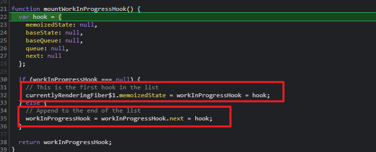
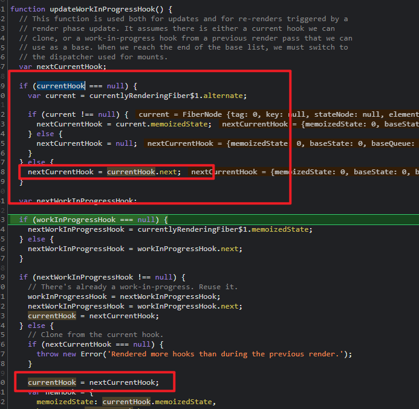

## 前言

> 今天的目的主要是学习下 react 中 hooks 之 useState. 通过使用/ 手写/ 解读源码的方式来记录下学习过程。<br/>
>
> - 首先要说明一点：为什么会用 react hooks 的出现？解决了什么问题？
>   - react 类组件中可以设置 state 状态，可以添加生命周期的函数，但是需要每次都实例化消耗资源。
>   - 函数组件呢？写法简单但是无法保存状态。
> - 所以 react hook 的出现就是为了在使用函数组件的时候，还能提供状态供其使用

## 开始

### 1. 使用

> 接下来我们先了解下用法，到底该如何使用呢？？？

```js
import React from "react";
import ReactDOM from "react-dom";
import { useState } from "react";

function App() {
  const [state, setState] = useState(() => ({ count: 0 }));
  const [count, setCount] = useState(0);

  const addCount = () => {
    setState(state => ({ count: state.count + 1 }));
  };

  const addCount1 = () => {
    setCount(count - 1);
  };

  return (
    <div>
      {state.count}
      <br />
      <button onClick={addCount}>+</button>
      <hr />
      {count}
      <br />
      <button onClick={addCount1}>-</button>
    </div>
  );
}

ReactDOM.render(<App />, document.getElementById("root"));
```

> 上述是一个很简单的实例，体现了 useState 两种用法。
>
> - 第一个呢，可以传递单纯的值给函数，获取的值也是单纯的。
> - 第二个呢，可以是一个函数，这个函数必须返回一个值，获取的值就是这个值
>   同样，在设置`setState`的时候同样对应两种不同的设置方式。

- 也许有人问了，一定要叫`state`以及`setState`吗？？？ 这个不一定哦，在实际的源码中只不过给你返回一个数组，第一个是具体的值，第二个是设置值的函数。至于名称，自己随便定义即可

### 2. 手写原理

> 注意：在源码中其实`useState`跟`useReducer`实现是保持一致的，只不过只是有些许的区别
> 下面的代码参照[手写源码映射地址](https://github.com/a572251465/mini-react/tree/master/src/core/lib/react-dom.js) > https://github.com/a572251465/mini-react/tree/master/src/core/lib/react-dom.js 欢迎 star

```js
// 表示当前hook所处的下标位置
let hookIndex = 0;
// 存储所有的hook状态
const valueStack = [];

export function useState(initValue) {
  return useReducer(null, initValue);
}

export function useReducer(reducer, initValue) {
  valueStack[hookIndex] = valueStack[hookIndex] || initValue;
  let currentIndex = hookIndex;

  function dispatch(action) {
    const oldState = valueStack[currentIndex];

    if (reducer) {
      const newState = reducer(oldState, action);
      valueStack[currentIndex] = newState;
    } else {
      const newState = typeof action === "function" ? action(oldState) : action;
      valueStack[currentIndex] = newState;
    }
    scheduleUpdate();
  }
  return [valueStack[hookIndex++], dispatch];
}
```

- 这里先解释下函数组件结合 useState 渲染过程： - 首先内部实现过程中可以用数组，以及索引来实现 - 当第一次渲染函数组件的时候，会调用 useState. 此时，会将 useState 的默认值存放到数组下标位置中，同时把值进行返回。好比上述的`const [state, setState] = useState(1)` - 当我们调用`setState`的同时，其实修改了数组中保存的值，立马会触发 dom 更新。同时`下标归零` - 重新获取对应下标中的值，这个时候获取到的值就是修改后的值 - 也许有人疑问了？？？这个下标归零是什么操作呢。其实我们可以想想当两个`useState`存在的话，初次渲染使用的下标是 0,1. 那更新 dom 的时候获取值使用的必须是不是也必须是 0,1 啊
  > 接下来根据手写来具体分析下
- 如果是第一次渲染，那数组下标位置中肯定没有值的，此时是不是就是初期值了。对应的手写代码是不是`valueStack[hookIndex] = valueStack[hookIndex] || initValue`
- 同时我们内部提供一个`dispatch`方法以及返回一个数组。`return [valueStack[hookIndex++], dispatch]`. 第一次获取值肯定就是设置初期化的值了
- 内部提供的`dispatch`函数其实就是所谓的`setState`. 开始调用 setState 进行设置新值。 内部执行了`const newState = typeof action === 'function' ? action(oldState) : action; valueStack[currentIndex] = newState` 代码。
- dom 更新后，重新获取值的时候，就是获取更新后的值了

### 3. 分析源码

> 我们上述手写的代码中功能逻辑实现了。但是源码中没有这么简单。源码我们以 react18 为分析版本，我也希望我能尽可能的讲解明白其原理。最起码给大家提供一个思路

- 我们在使用的过程中，无论是初期渲染还是更新 dom 虽然都调用了`useState`. 但是源码中其实分为两步走的。

```js
// 源码中存在两个对象，通过一个调度器来解析该调用哪个对象
// packages/react-reconciler/src/ReactFiberHooks.new.js
const HooksDispatcherOnMountInDEV = {
  useState: XXX,
};
const HooksDispatcherOnUpdateInDEV = {
  useState: XXX,
};

// packages/react/src/ReactHooks.js
const dispatcher = resolveDispatcher();
return dispatcher.useState(initialState);
```

- 首先我们来看下初次渲染的 useState

```js
    useState<S>(
      initialState: (() => S) | S,
    ): [S, Dispatch<BasicStateAction<S>>] {
      currentHookNameInDev = 'useState'
      try {

        // 挂载state
        return mountState(initialState);
      } finally {
        ReactCurrentDispatcher.current = prevDispatcher;
      }
    }
```

- `mountState`才是我们应该关注的重点

```js
// 表示挂载state
function mountState<S>(
  initialState: (() => S) | S
): [S, Dispatch<BasicStateAction<S>>] {
  const hook = mountWorkInProgressHook();

  // 判断是否是函数 如果是函数的话 直接返回函数结果
  if (typeof initialState === "function") {
    // $FlowFixMe: Flow doesn't like mixed types
    initialState = initialState();
  }
  hook.memoizedState = hook.baseState = initialState;
  const queue: UpdateQueue<S, BasicStateAction<S>> = {
    pending: null,
    interleaved: null,
    lanes: NoLanes,
    dispatch: null,
    // 用来判断action是否是函数的处理器 如果是函数 直接函数返回最新的结果  反之直接返回
    lastRenderedReducer: basicStateReducer,
    // 保存最后的数据 为了跟上一次做比较
    lastRenderedState: (initialState: any),
  };
  hook.queue = queue;
  const dispatch: Dispatch<BasicStateAction<S>> = (queue.dispatch =
    (dispatchSetState.bind(null, currentlyRenderingFiber, queue): any));
  return [hook.memoizedState, dispatch];
}
```

> 源码内部使用对象来实现的，通过上述的源码解析可以看到如果你的函数`useState`是一个函数的话，会执行函数拿到返回值
> 函数`dispatchSetState`就是我们结构出来的`setState`. 当我们需要修改值的时候会调用该方法

- 接下来简单看下函数`dispatchSetState`内部实现

```js
// action 有可能是函数 有可能是对象 就是所谓的setState中的参数
function dispatchSetState<S, A>(
  fiber: Fiber,
  queue: UpdateQueue<S, A>,
  action: A
) {

  const lane = requestUpdateLane(fiber);

  const update: Update<S, A> = {
    lane,
    action,
    hasEagerState: false,
    eagerState: null,
    next: (null: any),
  };

  if (isRenderPhaseUpdate(fiber)) {
    enqueueRenderPhaseUpdate(queue, update);
  } else {
    enqueueUpdate(fiber, queue, update, lane);

    const alternate = fiber.alternate;
    if (
      fiber.lanes === NoLanes &&
      (alternate === null || alternate.lanes === NoLanes)
    ) {
      // The queue is currently empty, which means we can eagerly compute the
      // next state before entering the render phase. If the new state is the
      // same as the current state, we may be able to bail out entirely.

      // 获取上一次的reducer
      const lastRenderedReducer = queue.lastRenderedReducer;
      if (lastRenderedReducer !== null) {
        let prevDispatcher;
        if (__DEV__) {
          prevDispatcher = ReactCurrentDispatcher.current;
          // 第二次执行 执行updateState 其实是从这里赋值的
          ReactCurrentDispatcher.current = InvalidNestedHooksDispatcherOnUpdateInDEV;
        }
        try {
          // 上一次的state
          const currentState: S = (queue.lastRenderedState: any);
          // 当前最新的state
          const eagerState = lastRenderedReducer(currentState, action);
          update.hasEagerState = true;
          update.eagerState = eagerState;

          // 如果值没有发生变化 直接返回
          if (is(eagerState, currentState)) {
            return;
          }
        } catch (error) {
          // Suppress the error. It will throw again in the render phase.
        } finally {
          if (__DEV__) {
            ReactCurrentDispatcher.current = prevDispatcher;
          }
        }
      }
    }
}
```

> 1. 重点解释：
> 2. 调度器凭什么知道更新 dom 的时候要执行具有更新方法的`useState`呢，全靠代码`ReactCurrentDispatcher.current = InvalidNestedHooksDispatcherOnUpdateInDEV;`这个句话
> 3. 在上述代码中 会比较新旧值 而从判断是否更新 dom
> 4. 函数中有两个变量很重要`queue`以及`update`. `queue`表示初期渲染的时候构成的对象，`update`更新构建的对象

- 接下来看下更新渲染时候的`useState`

```js
// packages/react-reconciler/src/ReactFiberHooks.new.js
    useState<S>(
      initialState: (() => S) | S,
    ): [S, Dispatch<BasicStateAction<S>>] {
      currentHookNameInDev = 'useState';
      try {
        return updateState(initialState);
      } finally {
        ReactCurrentDispatcher.current = prevDispatcher;
      }
    },
```

- 执行函数`updateState`

```js
// 执行updateState
function updateState<S>(
  initialState: (() => S) | S
): [S, Dispatch<BasicStateAction<S>>] {
  return updateReducer(basicStateReducer, (initialState: any));
}
```

> 通过上述代码可以看出 useState 跟 useReduer 保持一处逻辑处理。 接下来我们看下函数`updateReducer`

- 函数`updateReducer`处理

```js
function updateReducer<S, I, A>(
  reducer: (S, A) => S,
  initialArg: I,
  init?: I => S
): [S, Dispatch<A>] {
  const hook = updateWorkInProgressHook();
  const queue = hook.queue;

  queue.lastRenderedReducer = reducer;

  const current: Hook = (currentHook: any);

  // The last rebase update that is NOT part of the base state.
  let baseQueue = current.baseQueue;

  // The last pending update that hasn't been processed yet.
  const pendingQueue = queue.pending;
  if (pendingQueue !== null) {
    // We have new updates that haven't been processed yet.
    // We'll add them to the base queue.
    if (baseQueue !== null) {
      // Merge the pending queue and the base queue.
      const baseFirst = baseQueue.next;
      const pendingFirst = pendingQueue.next;
      baseQueue.next = pendingFirst;
      pendingQueue.next = baseFirst;
    }
    if (__DEV__) {
      if (current.baseQueue !== baseQueue) {
        // Internal invariant that should never happen, but feasibly could in
        // the future if we implement resuming, or some form of that.
        console.error(
          "Internal error: Expected work-in-progress queue to be a clone. " +
            "This is a bug in React."
        );
      }
    }
    current.baseQueue = baseQueue = pendingQueue;
    queue.pending = null;
  }

  if (baseQueue !== null) {
    // We have a queue to process.
    const first = baseQueue.next;
    let newState = current.baseState;

    let newBaseState = null;
    let newBaseQueueFirst = null;
    let newBaseQueueLast = null;
    let update = first;
    do {
      const updateLane = update.lane;
      if (!isSubsetOfLanes(renderLanes, updateLane)) {
        // Priority is insufficient. Skip this update. If this is the first
        // skipped update, the previous update/state is the new base
        // update/state.
        const clone: Update<S, A> = {
          lane: updateLane,
          action: update.action,
          hasEagerState: update.hasEagerState,
          eagerState: update.eagerState,
          next: (null: any),
        };
        if (newBaseQueueLast === null) {
          newBaseQueueFirst = newBaseQueueLast = clone;
          newBaseState = newState;
        } else {
          newBaseQueueLast = newBaseQueueLast.next = clone;
        }
        // Update the remaining priority in the queue.
        // TODO: Don't need to accumulate this. Instead, we can remove
        // renderLanes from the original lanes.
        currentlyRenderingFiber.lanes = mergeLanes(
          currentlyRenderingFiber.lanes,
          updateLane
        );
        markSkippedUpdateLanes(updateLane);
      } else {
        // This update does have sufficient priority.

        if (newBaseQueueLast !== null) {
          const clone: Update<S, A> = {
            // This update is going to be committed so we never want uncommit
            // it. Using NoLane works because 0 is a subset of all bitmasks, so
            // this will never be skipped by the check above.
            lane: NoLane,
            action: update.action,
            hasEagerState: update.hasEagerState,
            eagerState: update.eagerState,
            next: (null: any),
          };
          newBaseQueueLast = newBaseQueueLast.next = clone;
        }

        // Process this update.
        if (update.hasEagerState) {
          // If this update is a state update (not a reducer) and was processed eagerly,
          // we can use the eagerly computed state
          newState = ((update.eagerState: any): S);
        } else {
          const action = update.action;
          newState = reducer(newState, action);
        }
      }
      update = update.next;
    } while (update !== null && update !== first);

    if (newBaseQueueLast === null) {
      newBaseState = newState;
    } else {
      newBaseQueueLast.next = (newBaseQueueFirst: any);
    }

    // Mark that the fiber performed work, but only if the new state is
    // different from the current state.
    if (!is(newState, hook.memoizedState)) {
      markWorkInProgressReceivedUpdate();
    }

    hook.memoizedState = newState;
    hook.baseState = newBaseState;
    hook.baseQueue = newBaseQueueLast;

    queue.lastRenderedState = newState;
  }

  // Interleaved updates are stored on a separate queue. We aren't going to
  // process them during this render, but we do need to track which lanes
  // are remaining.
  const lastInterleaved = queue.interleaved;
  if (lastInterleaved !== null) {
    let interleaved = lastInterleaved;
    do {
      const interleavedLane = interleaved.lane;
      currentlyRenderingFiber.lanes = mergeLanes(
        currentlyRenderingFiber.lanes,
        interleavedLane
      );
      markSkippedUpdateLanes(interleavedLane);
      interleaved = ((interleaved: any).next: Update<S, A>);
    } while (interleaved !== lastInterleaved);
  } else if (baseQueue === null) {
    // `queue.lanes` is used for entangling transitions. We can set it back to
    // zero once the queue is empty.
    queue.lanes = NoLanes;
  }

  const dispatch: Dispatch<A> = (queue.dispatch: any);
  return [hook.memoizedState, dispatch];
}
```

> 上述的代码看起来很复杂，但是其实只不过是前后关联太大了。如果是单单看这个代码是无法进行理解的。不过这里我将重点抽取出来，单独看看
>
> 1. 代码`newState = ((update.eagerState: any): S);` 就是为了赋值新的 state。因为我们在执行函数`dispatchSetState`的时候，对其赋值过值了，所以这里拿来用就可以了
> 2. 代码`hook.memoizedState = newState;` 就是为了将新的值重新赋值到 hook 上，方便下次直接在 hook 获取新的值
> 3. 代码`const dispatch: Dispatch = (queue.dispatch: any);` 就是从 queue 中获取原来设定好的更新函数，这个函数值哪来的呢？就是初期渲染执行 useState 的时候，`dispatchSetState.bind`的返回方法
> 4. 代码`return [hook.memoizedState, dispatch];`中，就是返回最新的值以及需要更新的方法

### 4. 为什么 hook 不能在 if 或是 for 循环中



- 上述的截图中的方式是执行`mountState`执行的，为了获取当前 hook 上下文。
- 变量`workInProgressHook` 表示工作进度 hook 挂载当前方法的 hook
- 通过上述的 if 判断可以看出，其实是通过`next`属性将每个 hook 上下串联起来的



- 如果页面的更新后，重新执行 useState。从重新从 Fiber 中获取 hook
- 所以必须保证初次渲染以及更新渲染的 hook 顺序 必须保持一致

## end

> 上述就是大致的`useState`执行的过程。以及源码分析。在源码中多处看才能得到最后的结果。并不是希望读者看到我的分析后立马就懂源码，而是提供一种看源码的思路。希望我的“啰嗦”可以帮助到大家
