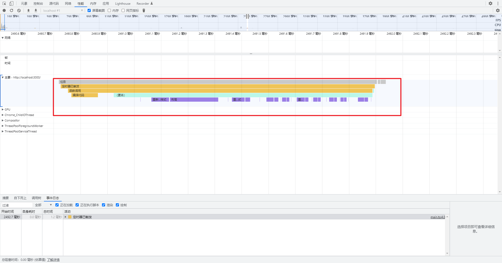
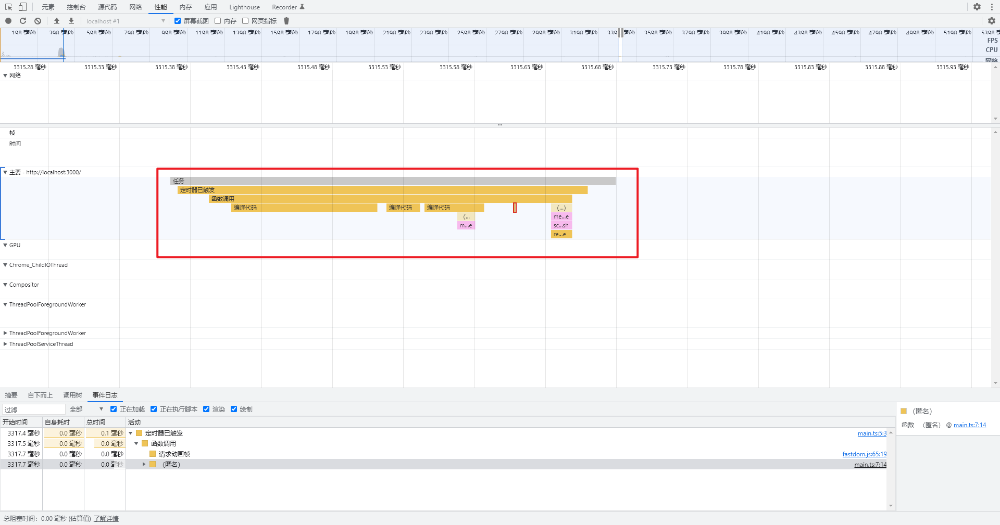

## 布局抖动
> 什么叫布局抖动呢？？？ 大体的意思可以理解为边获取边设置。因为要获取最新的布局数据，所以会强制绘制。在优化的时候会有“`读写分离`”。 接下来会演示下读写分离的现象，以及应对方法

### 演示实例
> 布局抖动的代码
```js
const app = document.querySelector<HTMLDivElement>('#app')!

window.onload = function () {
  setTimeout(() => {
    for (let i = 0; i < 10; i += 1) {
      app.style.left = `${app.offsetLeft + 10}px`
    }
  }, 2000)
}
```


> 使用插件`fastdom`来将任何进行合并。用来优化布局抖动
```js
import fastDom from 'fastdom'

const app = document.querySelector<HTMLDivElement>('#app')!

window.onload = function () {
  setTimeout(() => {
    for (let i = 0; i < 10; i += 1) {
      fastDom.measure(() => {
        const { offsetLeft } = app
        fastDom.mutate(() => {
          app.style.left = `${offsetLeft + 100}px`
        })
      })
    }
  }, 2000)
}
```
