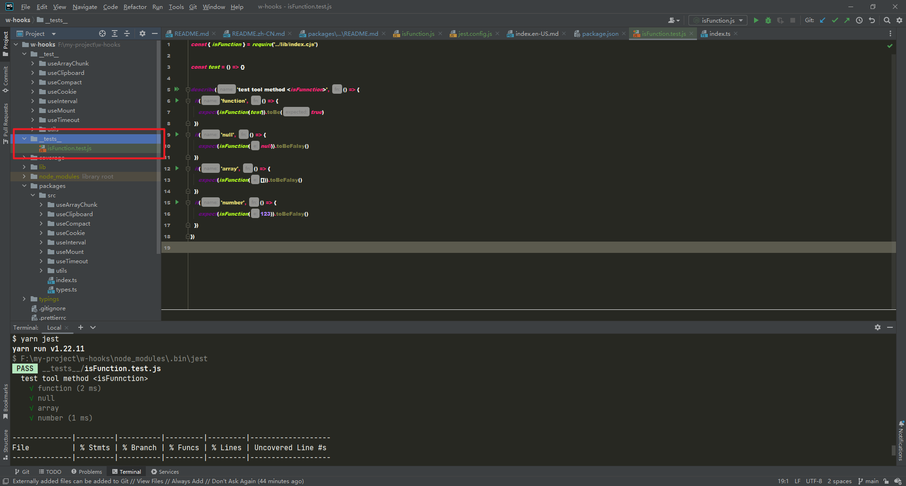

## Jest

### 1. 默认路径

- 在项目中 jest 的默认路径是`__tests__/*.test.js`
  

### 2. 匹配器

- `test` 表示测试 wrap 表述
- `expect` 表示运行的测试用例
- `toBe` 表示用来比较的值，结果函数表达式 类似于 `===` 以及`Object.is`
- `toEqual` 表示匹配内容的匹配器。 可以匹配对象以及普通值
- `toBeNull` 用来匹配 null
- `toBeUndefined` 用来匹配 undefined
- `toBeTruthy` 用来匹配 true 匹配器
- `toBeFalsy` 用来匹配 false 匹配器
- `not` 用来匹配取反的效果 `expect(xxx).not.toBeFalsy()`
- `toBeGreaterThan` 比 xxx 数大的匹配器
- `toBeLessThan` 比 xxx 数小的匹配器
- `toBeCloseTo` 比较浮点数的数字类型的匹配器
- `toContain` 表示匹配数组/ Set 等 具有包含关系的匹配器

```javascript
const { isFunction } = require('../lib/index.cjs')

const test1 = () => {}

test('is function', () => {
  expect(isFunction(test1)).toBe(true)
})
```

### 3. babel

- 可以在项目中配置`.babelrc`. jest 会结合内置的 jest-babel。 在运行真实的代码之前，先对代码进行转换

```json
{
  "presets": [
    [
      "@babel/preset-env",
      {
        "targets": {
          "node": "current"
        }
      }
    ]
  ]
}
```

### 4. 钩子函数

- `beforeAll` 所有的测试用例之前执行
- `afterAll` 所有的测试用例之后执行
- `beforeEach` 每个测试用例之前 都会执行一次这个钩子函数
- `describe` 表示测试分组

### 5. mock

#### 1. 模拟函数

[测试 demo](https://github.com/a572251465/jest-case-demo/blob/main/__tests__/fnCall.test.js)

#### 2. 模拟请求

[测试 demo](https://github.com/a572251465/jest-case-demo/blob/main/__tests__/req.test.js)

#### 3. 模拟 timer

```javascript
import timer from './timer'

jest.useFakeTimers()

test('timer 测试', () => {
  const fn = jest.fn()
  timer(fn)
  jest.runOnlyPendingTimers()
  expect(fn).toHaveBeenCalledTimers(1)
})
```
